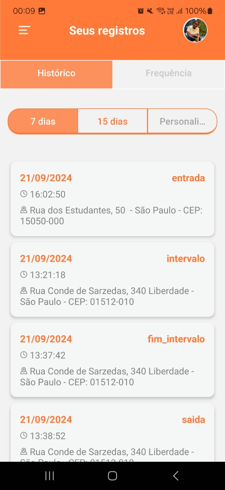

# Aplicativo Ponto Fácil

## Visão Geral

O aplicativo é voltado para empresas de pequeno porte que precisam de uma solução prática e eficiente para o controle de horas trabalhadas por seus funcionários. Ele permite a marcação de pontos de entrada, intervalos, fim de intervalos e saída, oferecendo uma interface simples e amigável para registro de jornadas. Ideal para empresas que desejam otimizar o acompanhamento de horas trabalhadas e a gestão de tempo dos colaboradores, o app oferece facilidade no monitoramento e na geração de relatórios de ponto.

O aplicativo foi desenvolvido em React Native com funcionalidades de login, home, perfil, relatórios e atualização de dados. Ele utiliza navegação com react-navigation, integração com uma API REST para autenticação e armazenamento de tokens usando AsyncStorage. A estrutura do projeto foi organizada em diferentes componentes e telas, permitindo fácil escalabilidade e manutenção.

## Imagens das Telas

<div style="display: flex; flex-wrap: wrap; gap: 10px; justify-content: center;">
  
  
  
  
  
  
  
  
</div>

## Instalação

1. Clone este repositório:

```bash
git clone https://github.com/ZimboSebastiao/ponto-facil.git
```

2. Instale as dependências:

```bash
npm install
```

3. Execute o aplicativo:

```bash
npx expo start
```

## Estrutura de Pastas

```plaintext
.
├── .expo
├── assets
│   └── images
│       ├── icon.png
│       ├── img-login.png
│       ├── inicio.png
│       ├── logi.png
│       ├── login.png
│       ├── perfil.jpg
│       ├── ponto.png
│       ├── signin.png
│       └── splash.png
├── node_modules
├── src
│   ├── components
│   │   ├── CheckAuth.js
│   │   └── Logout.js
│   └── screens
│       ├── Atualizar.js
│       ├── Home.js
│       ├── Login.js
│       ├── Perfil.js
│       ├── Relatorio.js
│       └── UsuarioAvatar.js
├── .gitignore
├── App.js
├── app.json
├── babel.config.cjs
├── gesture-handler.js
├── gesture-handler.native.js
├── package-lock.json
├── package.json
└── README.md

```

## Funcionalidades Principais

### 1. Autenticação de Usuário

O aplicativo faz autenticação usando a API através do endpoint /login. O login é baseado em credenciais de e-mail e senha, e os tokens recebidos são armazenados usando AsyncStorage.

### 2. Navegação entre Telas

A navegação entre telas é gerenciada por react-navigation com uma combinação de Stack Navigator e Drawer Navigator para criar um menu lateral.

### 3. Armazenamento de Tokens

Os tokens de autenticação e seus tempos de expiração são armazenados localmente usando AsyncStorage. Caso o token expire, o aplicativo tenta renovar o token usando o refresh token.

### 4. Relatórios e Histórico

O usuário pode visualizar relatórios e históricos relacionados às suas atividades no aplicativo. A tela de Relatório exibe dados, como eventos e registros de tempo, e permite ao usuário carregar ou atualizar uma imagem de perfil.

## Tecnologias Utilizadas

- **React Native:** Framework para desenvolvimento de aplicativos mobile.
- **Expo:** Plataforma para desenvolvimento de apps React Native.
- **Axios:** Cliente HTTP para chamadas à API.
- **AsyncStorage:** Armazenamento local no dispositivo para tokens de autenticação.
- **React Navigation:** Gerenciamento de navegação entre telas.

## Considerações Finais

O aplicativo está sendo desenvolvido com o objetivo de ajudar pequenas empresas a gerenciar de forma eficiente as horas de trabalho dos seus funcionários. Buscamos criar uma ferramenta funcional, intuitiva e acessível, que simplifique o processo de marcação de ponto e contribua para a organização interna da empresa. Nosso foco está em oferecer uma solução útil que atenda às necessidades das pequenas empresas, garantindo praticidade e eficiência no dia a dia.
